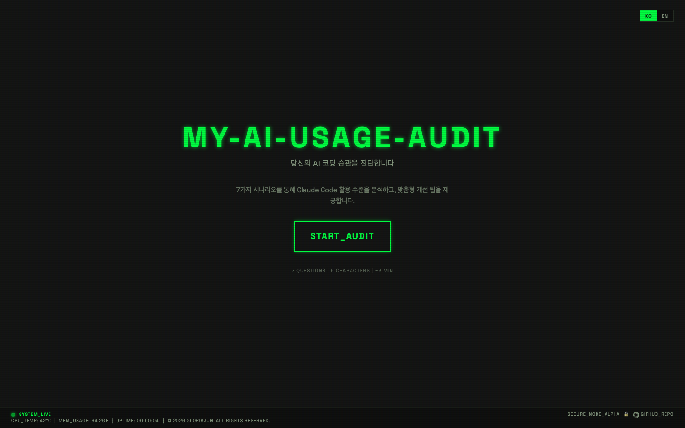
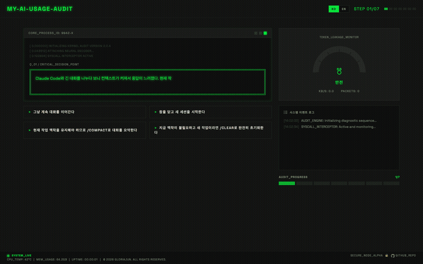

# My AI Usage Audit


An interactive web app that audits your AI coding habits.  
It analyzes your usage pattern through a 7-scenario quiz and provides a result character, weak-category diagnostics, and actionable improvement guides.

## Screenshots



### Flow (Quiz to Result)



## Key Features

- 7-scenario quiz with real-time progress tracking
- Token-efficiency gauge and system-log feedback UI
- Result page with character card, radar chart, and actionable insights
- Result card export and sharing
- `KO / EN` language toggle
- Responsive retro terminal-themed UI (including mobile)

## Tech Stack

- Next.js 16 (App Router)
- TypeScript
- Zustand
- Framer Motion
- Static Export (`output: "export"`)

## Project Structure

```text
src/
  app/
    page.tsx           # Landing
    quiz/page.tsx      # Quiz
    result/page.tsx    # Result
  components/
    quiz/
    result/
    common/
  data/
    questions.ko.ts
    questions.en.ts
    characters.ts
  i18n/
    store.ts
    messages.ts
  store/
    useQuizStore.ts
```

## Local Development

```bash
pnpm install
pnpm dev
```

- Local URL: `http://localhost:3000`

## Build & Verify

```bash
pnpm lint
pnpm tsc --noEmit
pnpm build
```

## Deployment

This project is configured for static deployment by default.

- Config: `next.config.ts` → `output: "export"`
- Build output: `out/`
- Recommended hosts: Vercel or GitHub Pages

## Docs

- [PRD](./docs/PRD.md)
- [TRD](./docs/TRD.md)
- [Design Spec](./docs/design-spec.md)
- [User Flow](./docs/user-flow.md)

## Repository

- GitHub: https://github.com/gloriaJun/my-ai-usage-audit
