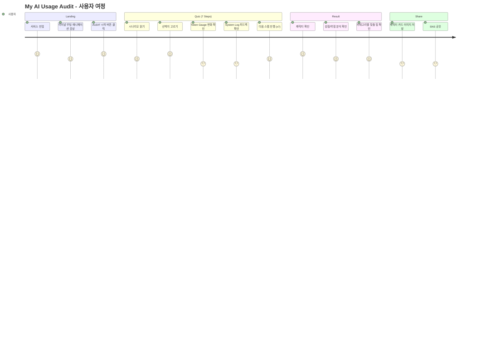
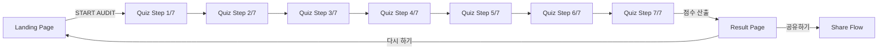
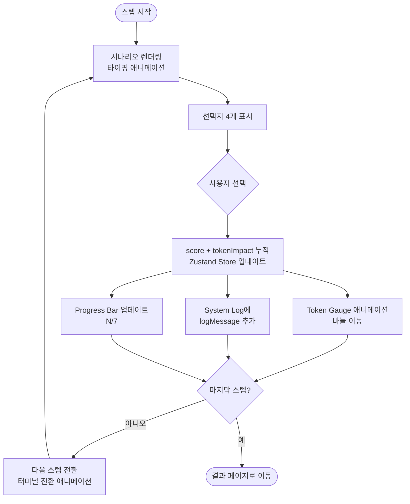
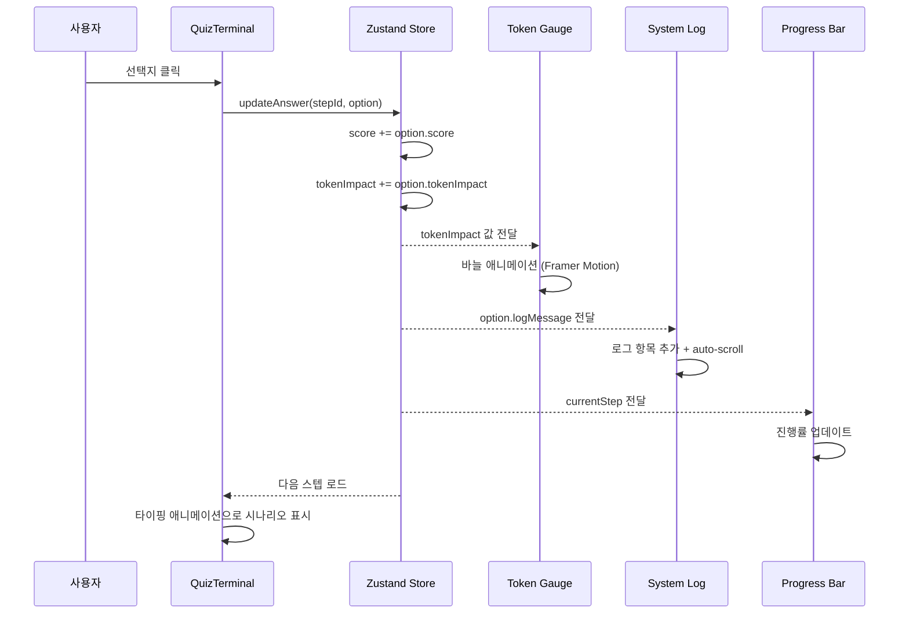
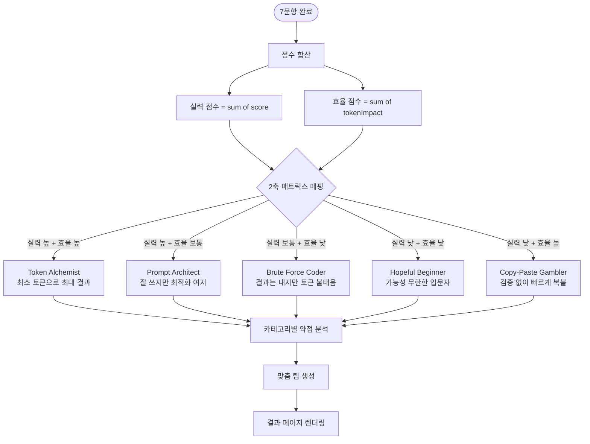
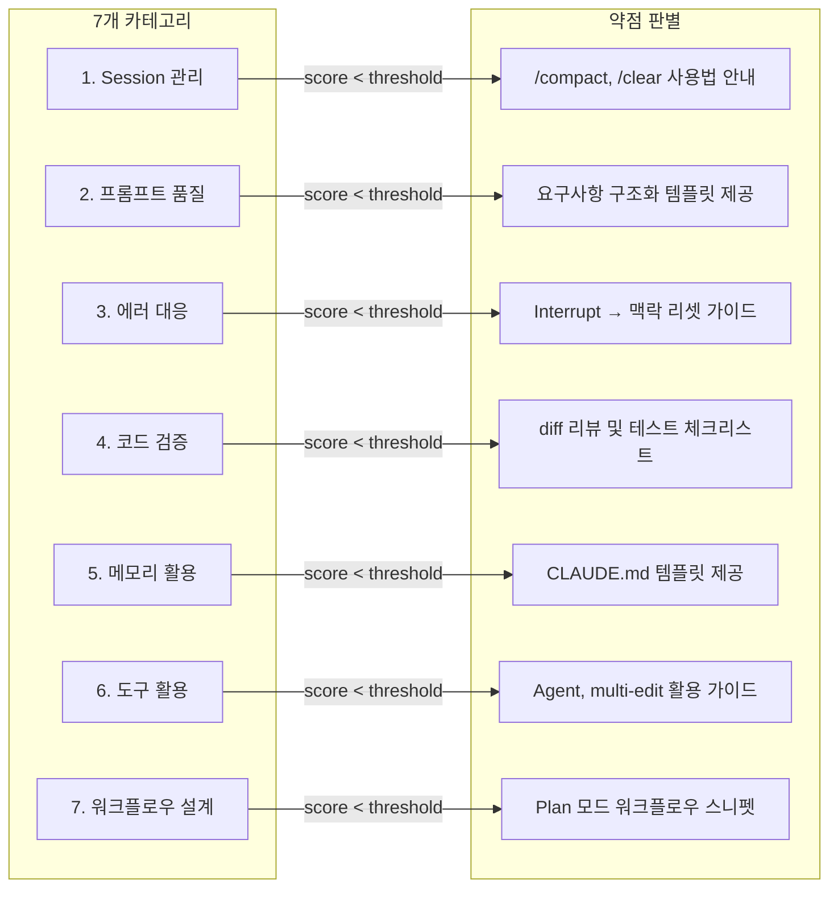
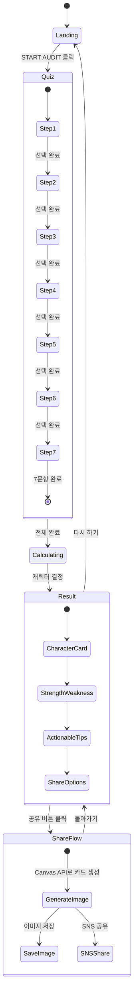

# User Flow: My AI Usage Audit

## 1. 전체 사용자 여정

사용자가 서비스에 진입하여 결과를 공유하기까지의 전체 플로우.



### 메인 플로우



## 2. 퀴즈 진행 상세 플로우

각 스텝에서 사용자 선택 → UI 피드백 → 상태 업데이트가 이루어지는 과정.



### 컴포넌트 간 상호작용



## 3. 결과 산출 로직

7문항 완료 후 캐릭터를 결정하고 맞춤 팁을 생성하는 과정.



### 카테고리별 진단 매핑



## 4. 화면 상태 다이어그램



## 5. UI 컴포넌트 매핑

Stitch 디자인 요소와 사용자 플로우의 연결 관계.

| Stitch 디자인 요소 | 컴포넌트 | 플로우 역할 | 데이터 소스 |
|---|---|---|---|
| Terminal Window (메인 영역) | `QuizTerminal` | 시나리오 + 선택지 표시 | `questions.json` → Zustand |
| Token Leakage Monitor (게이지) | `TokenGauge` | tokenImpact 실시간 시각화 | Zustand `tokenImpact` |
| System Event Log | `SystemLog` | 선택 결과 피드백 로그 | Zustand `logMessages[]` |
| Progress Bar (블록형) | `ProgressBar` | 퀴즈 진행률 (N/7) | Zustand `currentStep` |
| Data Stream (바이너리) | `DataStream` | 분위기 연출 (장식) | 정적 |
| CRT Overlay | `CrtOverlay` | 레트로 터미널 분위기 | CSS only |
| Top Bar (STEP 01/07) | `TopBar` | 현재 단계 표시 | Zustand `currentStep` |
| Footer (SYSTEM_LIVE) | `StatusBar` | 시스템 상태 연출 | 정적 + 타이머 |

### Zustand Store 구조

```mermaid
flowchart TD
    subgraph ZustandStore[Zustand Quiz Store]
        CS[currentStep: number]
        ANS[answers: Map]
        SC[totalScore: number]
        TI[totalTokenImpact: number]
        LOGS[logMessages: string array]
        CHAR[character: string | null]
    end

    subgraph Components
        QT[QuizTerminal]
        TG[TokenGauge]
        SL[SystemLog]
        PB[ProgressBar]
        RP[ResultPage]
    end

    CS --> QT
    CS --> PB
    TI --> TG
    LOGS --> SL
    SC --> RP
    TI --> RP
    CHAR --> RP
```
